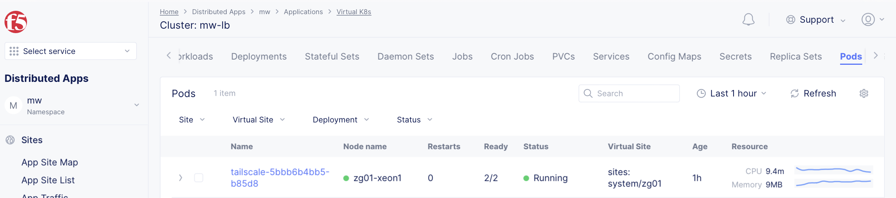
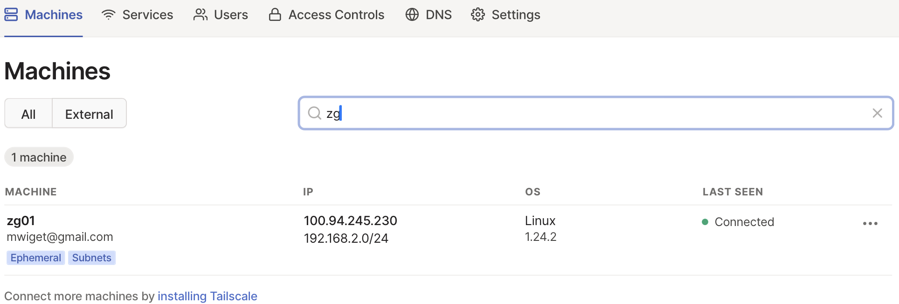
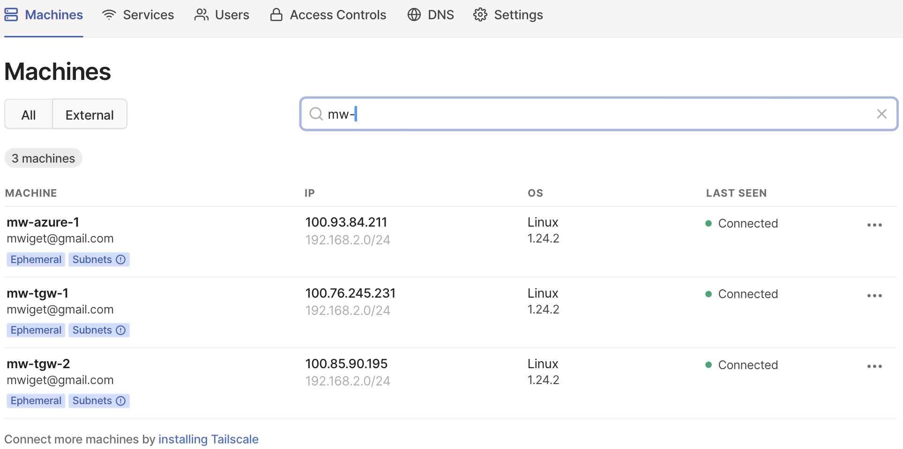
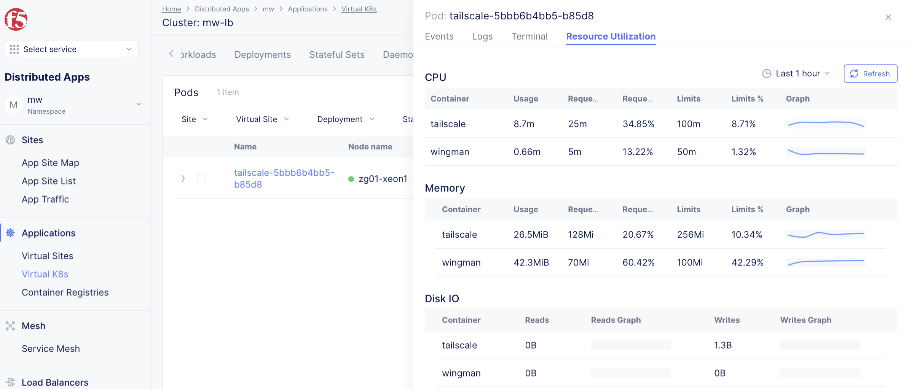

# f5-xc-vk8s-tailscale

Deploy Tailscale on F5 Distributed Cloud virtual Kubernetes Cluster vk8s. One or more CE sites 
are combined into a virtual site used as one virtual kubernetes cluster zg01. In this example,
the F5XC Site zg01 is the only site in the cluster zg01. Tailscale is
deployed, connecting to my Tailscale service and providing routed access
 to the attached inside network of the CE. 

When a virtual cluster consists of many distributed CE sites, then Tailscale can be deployed 
on all sites via vk8s and provide shell access for troubleshooting into the service network of each
CE site, ideal to run basic icmp ping and app services using curl.

```
        __________
       /          \
      /            \
     (   Internet   )
      \            /
       \__________/
            |
  . . . . . | . . . . . . 
 .  virtual | vk8s zg01  .
 .     site |            .
 .          | SLO        .
 .  +=================+  .
 .  |                 |  .
 .  |  .--- pod ---.  |  .  
 .  |  | Tailscale |  |  .   
 .  |  `-----------'  |  .    +------+ 
 .  |                 |  .  +------+ |
 .  +==== CE Site ====+  .  | host |-+
 .          | SLI        .  +------+
  . . . . . | . . . . . .       |
            |                   |
          --+-------------------+--
               192.168.2.0/24
```



## Requirements

- F5 Distributed Cloud https://f5.com/cloud
  - Virtual Site with at least one CE Site
  - Network Namespace in Tenant
  - Virtual Kubernetes Cluster vk8s
- Tailscale account https://tailscale.com

## Build and Deploy

The Makefile and Kubernetes manifest for Tailscale Container (https://github.com/tailscale/tailscale/blob/main/docs/k8s/)
have been adjusted for this use case.

### Create Tailscale Auth Key

Create an reusable/ephemeral auth key via Tailscale Console (https://login.tailscale.com/admin/settings/keys) to 
automatically register the new site(s) to your account. Either set the env variable AUTH_KEY or better, blindfold
the auth key using `vesctl requeset secrets` and place the base64 encoded encrypted secret in env variable BLINDFOLD.
(See https://docs.cloud.f5.com/docs/how-to/secrets-management/app-secrets-using-wingman and Makefile in this repo).

### Build Tailscale container

Set environment variables IMAGE_TAG, ROUTES and BLINDFOLD or AUTH_KEY:

```
$ printenv|grep 'ROUTES\|BLINDFOLD\|IMAGE_TAG'
IMAGE_TAG=marcelwiget/tailscale:latest
ROUTES=192.168.2.0/24
BLINDFOLD=AAAAE3BsYXlncm91bmQtd3RwcHZhb2cAAAABAAAAAAAAAHMCAAAABQOCX5jFAAABAO0SxofVOP47/NNin8p7AAW6hJLBRvvCmesEK+KeLIkAB+slZHrva3UkOcEcItTxfwesc0ezUeRLyNd3q3wRM6fPl8GfNmdl5GGXYWHIo2Am2zvBkXB68wKbu2rkY+CdNf8wYPC8t2x+bujqTF6lrkeEGnhXp4ndCdQSv5ZcekPZXlhrniYrfiQPWBcKLi3BZevZ0KFz4UrJpsqi3vt3EiySvm+XXco4Eu/ptntM7vtjtvzVJy7hEbtyFQXsOd3sAGnIYanDUcdmEOvqww5go/DIE8YEYkyMlZss6Mhi9Ean+sQ1m659Gco/oSsf9fJqhI7TauXlBk6+VgTa3L5gZ6MAAAEAqt/8uw7jt5CfKfytCH1v2dPbwVbjvMigj6O9nh3XcUVO/X8AOCkTN71JYnWx7Aq+VATBRvy2snSiXWyELm5AtZxe/cGyvtFBuBmv9HdBVfn80/HJwQdpeyZC450yYSuNZSZh42MYPR5abjrIMCTGEdrsufNlQTlcdA7f5GcPaeizrS2Si0Ail3UsbhJZQqPVLyHvkUp7q/Zz/JDagD0wkn5iINPrbT23Ggmf3npgS6E2kxzBnAeOhp/dgiAkKZ1qyNS6DBdbcPbCoQV8QcKMTo3OCb5r1qp4EQJxa0WJQIjo6oIGjHRAcMpnt7VJ958mA+TCBiyuQ5mSly6J8xm66/P4vkQiq1KTkgtl5vxYnFGZ7bM5BkjH37RHpU6wjUbdfDy5/m2ZJzoXsy5eXMA5PCS67OeQxM4kaw==
```

Build and push container image to your container registry of choice:

```
$ make build
$ make push
```

```
$ docker images |grep tailscale|grep latest
marcelwiget/tailscale                   latest      64398f5ecec3   2 hours ago     49.1MB
ghcr.io/tailscale/tailscale             latest      f3c6dda7a3e6   9 days ago      47MB
```

### Deploy Tailscale to vk8s Cluster

This step assumes you have a working vk8s cluster and downloaded the kubeconfig.

```
$ export KUBECONFIG=ves_zg_zg-ryzen.yaml 
$ kubectl cluster-info
Kubernetes control plane is running at https://playground.staging.volterra.us/api/vk8s/namespaces/zg/zg-ryzen

To further debug and diagnose cluster problems, use 'kubectl cluster-info dump'.
```

Deploy Tailscale with

```
$ make deploy
```

An alternate manifest [tailscale-ssh-deployment.yaml](tailscale-ssh-deployment.yaml) deploys an openssh server 
alongside tailscale and requires setting USER_NAME and PUBLIC_KEY, e.g.

```
$ printenv |grep 'USER_NAME\|PUBLIC'
USER_NAME=mwiget
PUBLIC_KEY=ssh-ed25519 AAAAC3NzaC1lZDI1NTE5AAAAINIoHbwDVeAxCrBqpFxAgozGdZSdLzBLvH1JiXmfFOHU mwiget@fedora0
```

Deploy this ssh enabled tailscale pod with `make ssh` instead of `make deploy`:

```
$ make ssh
```

Check the running pod with

```
$ kubectl get pods -o wide
NAME                         READY   STATUS    RESTARTS   AGE   IP          NODE         NOMINATED NODE   READINESS GATES
tailscale-5bbb6b4bb5-b85d8   2/2     Running   0          4m8s   10.1.0.38   zg01-xeon1   <none>           <none>
```

Grab log (example [tailscale-pod-log.txt](tailscale-pod-log.txt) with

```
$ kubectl logs tailscale-5bbb6b4bb5-b85d8 -c tailscale | tee tailscale-pod-log.txt 
```

Check Tailscale UI



### Test the new Tailscale site

The pod will use the CE site env variable VES_IO_SITENAME to automatically register the site with Tailscale.
Getting tailscale site info from any Tailscale connected device

```
$ tailscale status |grep zg01
100.94.245.230  zg01                 mwiget@      linux   active; relay "fra", tx 1640 rx 1464
```

Checking connectivity to zg01 pod running within vk8s

```
$ ping -c3 zg01
ING zg01.mwiget.gmail.com.beta.tailscale.net (100.94.245.230) 56(84) bytes of data.
64 bytes from zg01.mwiget.gmail.com.beta.tailscale.net (100.94.245.230): icmp_seq=1 ttl=64 time=36.4 ms
64 bytes from zg01.mwiget.gmail.com.beta.tailscale.net (100.94.245.230): icmp_seq=2 ttl=64 time=15.1 ms
64 bytes from zg01.mwiget.gmail.com.beta.tailscale.net (100.94.245.230): icmp_seq=3 ttl=64 time=17.5 ms

--- zg01.mwiget.gmail.com.beta.tailscale.net ping statistics ---
3 packets transmitted, 3 received, 0% packet loss, time 2003ms
rtt min/avg/max/mdev = 15.142/23.020/36.439/9.536 ms
```

after accepting subnet routes via UI, check connectivity to devices on the Site Local Inside Network (SLI, eth1):

```
$ ping -c3 192.168.2.100                                                                                                              
PING 192.168.2.100 (192.168.2.100) 56(84) bytes of data.                                                                                                                 
64 bytes from 192.168.2.100: icmp_seq=1 ttl=64 time=21.4 ms                                                                                                              
64 bytes from 192.168.2.100: icmp_seq=2 ttl=64 time=17.8 ms                                                                                                              
64 bytes from 192.168.2.100: icmp_seq=3 ttl=64 time=16.5 ms                                                                                                              

--- 192.168.2.100 ping statistics ---
3 packets transmitted, 3 received, 0% packet loss, time 2003ms
rtt min/avg/max/mdev = 16.532/18.579/21.367/2.041 ms
```

If the pod has been deployed with ssh enabled, you can access the pod via ssh as follows:

```
$ ssh -p 2222 mwiget@zg01
Welcome to OpenSSH Server

tailscale-67bd4589d5-p5fv8:~$ 
tailscale-67bd4589d5-p5fv8:~$ sudo ping 192.168.2.100
PING 192.168.2.100 (192.168.2.100): 56 data bytes
64 bytes from 192.168.2.100: seq=0 ttl=63 time=0.190 ms
64 bytes from 192.168.2.100: seq=1 ttl=63 time=0.158 ms
64 bytes from 192.168.2.100: seq=2 ttl=63 time=0.166 ms
^C
--- 192.168.2.100 ping statistics ---
3 packets transmitted, 3 packets received, 0% packet loss
round-trip min/avg/max = 0.158/0.171/0.190 ms
tailscale-67bd4589d5-p5fv8:~$ exit
```

## multi-site vk8s cluster example

Total of 4 CE's, cloud and baremetal mixed, build one virtual site with one vk8s. When new sites are added, the automatically instantiate the tailscale deployment, making those sites available via Tailscale VPN:

```
$ kubectl get pods -o wide
NAME                         READY   STATUS    RESTARTS   AGE     IP          NODE                                                   NOMINATED NODE   READINESS GATES
tailscale-5b9ff4c877-kw8rv   3/3     Running   0          19m     10.1.0.2    mw-tgw-1-ip-100-64-3-211.eu-north-1.compute.internal   <none>           <none>
tailscale-67bd4589d5-p5fv8   3/3     Running   0          13h     10.1.0.44   zg01-xeon1                                             <none>           <none>
tailscale-6c9df4c98f-k24p7   3/3     Running   0          5m52s   10.1.0.2    mw-azure-1-master-2                                    <none>           <none>
tailscale-7c65b775bc-5d4d7   3/3     Running   0          19m     10.1.0.2    mw-tgw-2-ip-100-64-35-164.us-west-2.compute.internal   <none>           <none>
```

```
 tailscale status |grep 'mw-\|zg01'
 100.93.84.211   mw-azure-1           mwiget@      linux   idle, tx 7396 rx 8108
 100.76.245.231  mw-tgw-1             mwiget@      linux   -
 100.85.90.195   mw-tgw-2             mwiget@      linux   -
 100.98.142.254  zg01                 mwiget@      linux   idle, tx 48892 rx 57236
```



Accessing mw-azure-1 via ssh to the pod:

```
$ ssh -p 2222 mw-azure-1                                                                                  
Welcome to OpenSSH Server

tailscale-6c9df4c98f-k24p7:~$ ip a
1: lo: <LOOPBACK,UP,LOWER_UP> mtu 65536 qdisc noqueue state UNKNOWN qlen 1000
    link/loopback 00:00:00:00:00:00 brd 00:00:00:00:00:00
    inet 127.0.0.1/8 scope host lo
       valid_lft forever preferred_lft forever
3: eth0@if67: <BROADCAST,MULTICAST,UP,LOWER_UP,M-DOWN> mtu 1436 qdisc noqueue state UP 
    link/ether 42:32:43:b1:68:fc brd ff:ff:ff:ff:ff:ff
    inet 10.1.0.2/16 brd 10.1.255.255 scope global eth0
       valid_lft forever preferred_lft forever
tailscale-6c9df4c98f-k24p7:~$ ping 1.1.1.1
PING 1.1.1.1 (1.1.1.1): 56 data bytes
ping: permission denied (are you root?)
tailscale-6c9df4c98f-k24p7:~$ sudo ping 1.1.1.1
PING 1.1.1.1 (1.1.1.1): 56 data bytes
64 bytes from 1.1.1.1: seq=0 ttl=55 time=5.214 ms
64 bytes from 1.1.1.1: seq=1 ttl=55 time=5.414 ms
64 bytes from 1.1.1.1: seq=2 ttl=55 time=5.142 ms
64 bytes from 1.1.1.1: seq=3 ttl=55 time=5.046 ms
^C
--- 1.1.1.1 ping statistics ---
4 packets transmitted, 4 packets received, 0% packet loss
round-trip min/avg/max = 5.046/5.204/5.414 ms
```

## Troubleshooting

Connectivity to tailscale is via relay in my case:

```
$ tailscale status|grep zg01
100.94.245.230  zg01                 mwiget@      linux   active; relay "fra", tx 17024 rx 20288
```

```
$ kubectl exec -ti tailscale-5bbb6b4bb5-b85d8 -- ash
Defaulted container "tailscale" out of: tailscale, wingman

/ $ ip a
1: lo: <LOOPBACK,UP,LOWER_UP> mtu 65536 qdisc noqueue state UNKNOWN group default qlen 1000
    link/loopback 00:00:00:00:00:00 brd 00:00:00:00:00:00
    inet 127.0.0.1/8 scope host lo
       valid_lft forever preferred_lft forever
3: eth0@if283: <BROADCAST,MULTICAST,UP,LOWER_UP> mtu 1436 qdisc noqueue state UP group default 
    link/ether 4e:f6:68:e0:c9:b3 brd ff:ff:ff:ff:ff:ff link-netnsid 0
    inet 10.1.0.38/16 brd 10.1.255.255 scope global eth0
       valid_lft forever preferred_lft forever

/ $ ip r
default via 10.1.0.1 dev eth0 
10.1.0.0/16 dev eth0 proto kernel scope link src 10.1.0.38 

/ $ ping -c3 192.168.2.100
PING 192.168.2.100 (192.168.2.100) 56(84) bytes of data.
64 bytes from 192.168.2.100: icmp_seq=1 ttl=63 time=0.223 ms
64 bytes from 192.168.2.100: icmp_seq=2 ttl=63 time=0.179 ms
64 bytes from 192.168.2.100: icmp_seq=3 ttl=63 time=0.182 ms

--- 192.168.2.100 ping statistics ---
3 packets transmitted, 3 received, 0% packet loss, time 2077ms
rtt min/avg/max/mdev = 0.179/0.194/0.223/0.020 ms

/ $ ps ax
PID   USER     TIME  COMMAND
    1 1000      0:00 {busybox} ash /run.sh
   30 1000      0:11 tailscaled --state=/tmp/tailscaled.state --socket=/tmp/tailscaled.sock --tun=userspace-networking
   64 1000      0:00 ash
   73 1000      0:00 ps ax
/ $ 
```

```
$ kubectl exec tailscale-5bbb6b4bb5-b85d8 -- printenv
Defaulted container "tailscale" out of: tailscale, wingman

PATH=/usr/local/sbin:/usr/local/bin:/usr/sbin:/usr/bin:/sbin:/bin
HOSTNAME=tailscale-5bbb6b4bb5-b85d8
HOST_OS_VERSION=centos-7-2009-25
HW_MODEL=sys-5019d-fn8tp
HW_VENDOR=supermicro
HW_VERSION=0123456789
VES_IO_FLEET=zg01-fleet
VES_IO_SITENAME=zg01
VES_IO_SITETYPE=ves-io-ce
AUTH_KEY=
ROUTES=192.168.2.0/24
DOMAIN=
HW_SERIAL_NUMBER=a329335x9715526
VES_IO_PROVIDER=ves-io-UNKNOWN
BLINDFOLD=AAAAE3BsYXlncm91bmQtd3RwcHZhb2cAAAABAAAAAAAAAHMCAAAABQOCX5jFAAABAO0SxofVOP47/NNin8p7AAW6hJLBRvvCmesEK+KeLIkAB+slZHrva3UkOcEcItTxfwesc0ezUeRLyNd3q3wRM6fPl8GfNmdl5GGXYWHIo2Am2zvBkXB68wKbu2rkY+CdNf8wYPC8t2x+bujqTF6lrkeEGnhXp4ndCdQSv5ZcekPZXlhrniYrfiQPWBcKLi3BZevZ0KFz4UrJpsqi3vt3EiySvm+XXco4Eu/ptntM7vtjtvzVJy7hEbtyFQXsOd3sAGnIYanDUcdmEOvqww5go/DIE8YEYkyMlZss6Mhi9Ean+sQ1m659Gco/oSsf9fJqhI7TauXlBk6+VgTa3L5gZ6MAAAEAqt/8uw7jt5CfKfytCH1v2dPbwVbjvMigj6O9nh3XcUVO/X8AOCkTN71JYnWx7Aq+VATBRvy2snSiXWyELm5AtZxe/cGyvtFBuBmv9HdBVfn80/HJwQdpeyZC450yYSuNZSZh42MYPR5abjrIMCTGEdrsufNlQTlcdA7f5GcPaeizrS2Si0Ail3UsbhJZQqPVLyHvkUp7q/Zz/JDagD0wkn5iINPrbT23Ggmf3npgS6E2kxzBnAeOhp/dgiAkKZ1qyNS6DBdbcPbCoQV8QcKMTo3OCb5r1qp4EQJxa0WJQIjo6oIGjHRAcMpnt7VJ958mA+TCBiyuQ5mSly6J8xm66/P4vkQiq1KTkgtl5vxYnFGZ7bM5BkjH37RHpU6wjUbdfDy5/m2ZJzoXsy5eXMA5PCS67OeQxM4kaw==
KUBERNETES_PORT_443_TCP_ADDR=10.3.0.1
KUBERNETES_SERVICE_HOST=10.3.0.1
KUBERNETES_SERVICE_PORT=443
KUBERNETES_SERVICE_PORT_HTTPS=443
KUBERNETES_PORT=tcp://10.3.0.1:443
KUBERNETES_PORT_443_TCP=tcp://10.3.0.1:443
KUBERNETES_PORT_443_TCP_PROTO=tcp
KUBERNETES_PORT_443_TCP_PORT=443
HOME=/
```

Check Pod resources in F5XC Console UI:



## Resources

- Tailscale kubernetes manifest example: https://github.com/tailscale/tailscale/blob/main/docs/k8s/subnet.yaml
- F5XC Blindfold App Secrets using Wingman: https://docs.cloud.f5.com/docs/how-to/secrets-management/app-secrets-using-wingman
